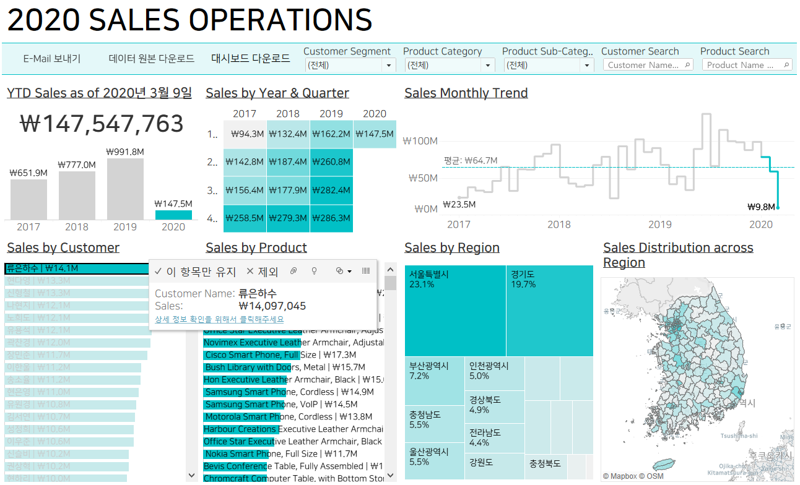
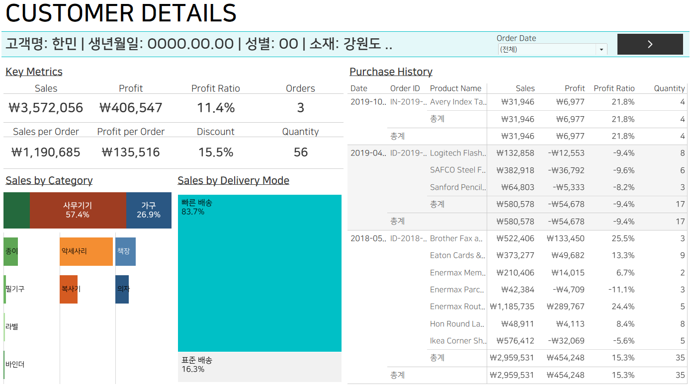
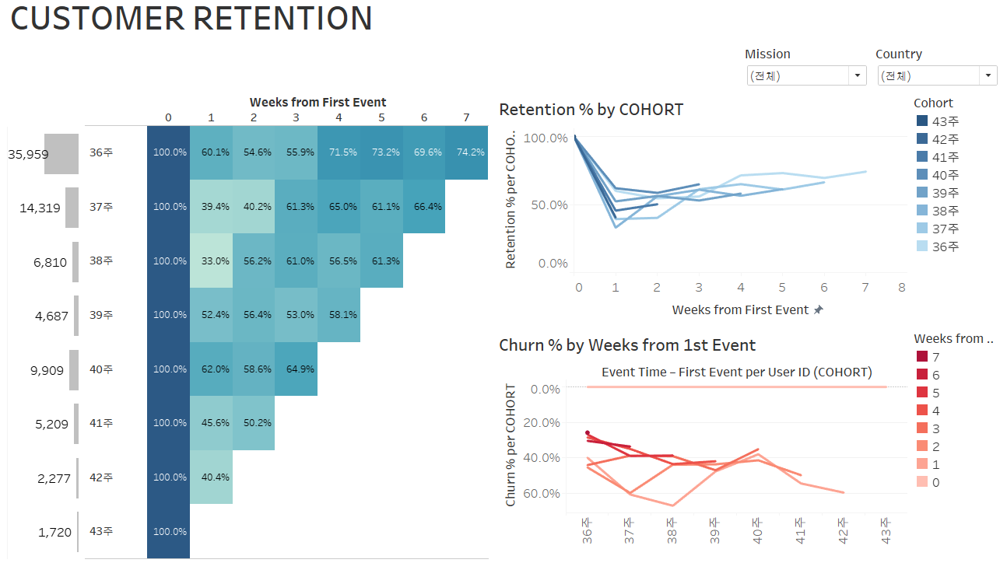

#  Tableau
- 다양한 시각화, 함수 활용 계산 필드 생성, 필터와 하이라이트 설정 등 활용 대시보드 제작 학습

## 1. inflearn tableau 기초 강의
- 태블로 대시보드 기초 - 판매현황 및 고객 정보 대시보드 (5/27 ~ 5/28)

- 태블로를 활용한 고객 획득 및 유지 패턴 분석 (5/29)

## 2. 태블로 신병훈련소 시각화 교육 11기 (11/26 ~ 12/10)
- 다양한 태블로 시각화 및 계산식 스킬의 기본을 쌓음
- 어떤 질문에 답할 대시보드인지를 먼저 생각한 후 만들어야 함의 중요성을 깨달음
	- 다이어트 중에 스타벅스 메뉴를 선택하려면 아메리카노가 최선일까?
		- 브루드커피 종류가 카페인은 높지만 평균 칼로리는 가장 낮음
	

	- covid19 확진자 및 사망자 데이터로 생성한 대시보드
		- Q1. 국가별 확진자 및 사망자 수는 얼마나 되는가? 어느 나라가 더 많은가?
		- Q2. 지역(대륙)별 확진자 분포는 어떠하며, 어떤 특징을 보이는가?
		- Q3. 국가별 확진자는 증가세인가 감소세인가?
	
