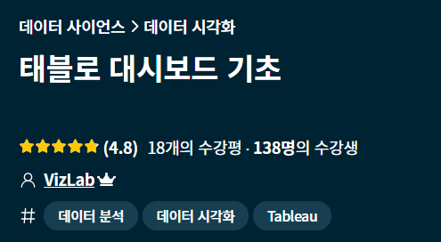
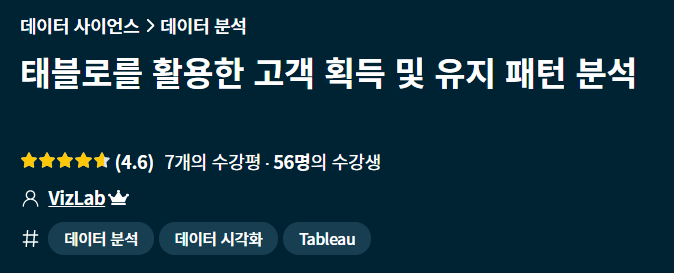
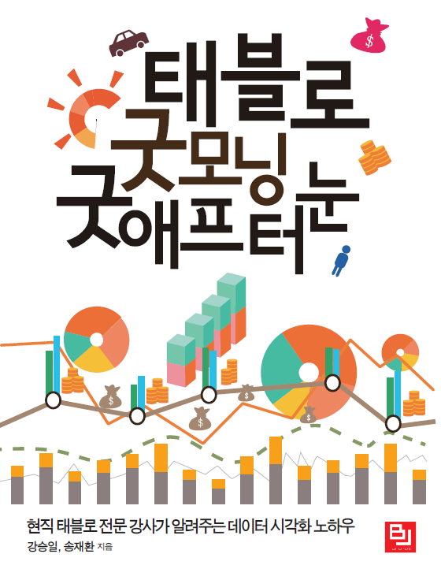

#  Tableau
Tableau 관련 inflearn 강의를 통해 전반적인 활용법 및 고객 분석 실습을 경험 할 수 있었다.

	- 다양한 시각화, 대시보드 제작 기초, 함수 활용 계산 필드 생성, 필터와 하이라이트 설정 등 학습
	- 고객 획득 및 유지 패턴 분석을 위한 대시보드 제작 경험

- 더 능숙한 활용을 위해 '태블로 굿모닝 굿애프터눈' 책 공부중

## 1. inflearn 강의
### 1-1. 태블로 대시보드 기초
- 5/27 ~ 5/28

### 1-2. 태블로를 활용한 고객 획득 및 유지 패턴 분석
- 5/29

## 2. [책] 태블로 굿모닝 굿애프터눈
- 6/1 ~ 6/10, 8/29 ~ 
