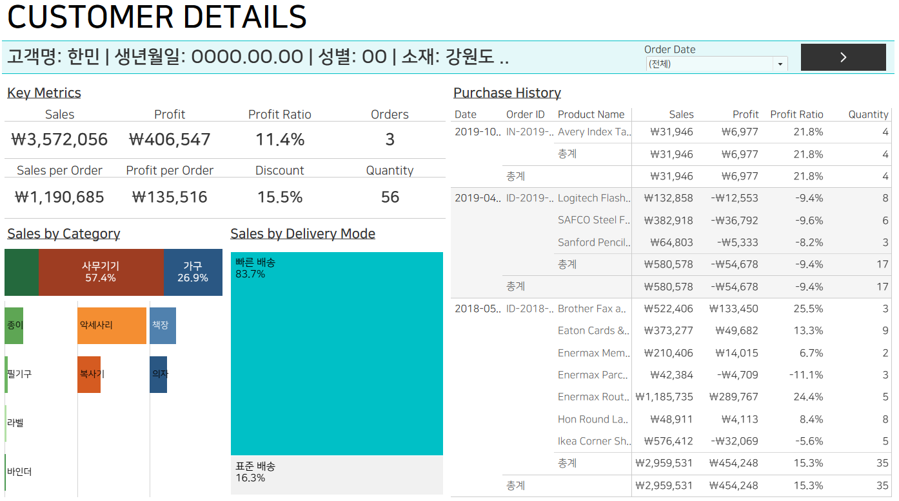

0. 좋은 대시보드를 만들기 위한 방법
```
	- 명확한 질문 던지기
		- 구체적이고 명확한 질문을 던지면, 어떤 대시보드를 만들어야할 지의 시작점이 됨
	- 질문에 답하며 정보를 구조화, 배치/활용 고민
	- 컨테이너와 공백개체를 적절히 사용해, 전체 구도 속 개개의 시트가 어떻게 들어가는 지 확인
	- 액션(특히 필터)을 적절히 활용하면 표현된 정보를 유기적으로 연결할 수 있어, 더 풍부한 데이터 탐색과 스토리텔링이 가능
```

1. 대시보드 구성 방법 및 각종 개체(컨테이너) 사용법
- 바둑판식(tiled) vs 부동(floating)
	- 바둑판식(자동조정)을 기본으로하되, 필요시 부동(고정) 방식으로 커스터마이징
- 컨테이너
	- 복수개의 시트를 하나의 큰 덩어리로 취급하여, 손쉽게 컨트롤 할 수 있는 도구
	- '콘텐츠 균등 분할 기능' 자주 사용!
		- 컨테이너 구성 요소 시트들의 크기를 동일하게 만들어줌
- 공백 개체(빈페이지)
	- 컨테이너안의 구성 모양을 잡을 때 유용하게 사용됨

2. 액션 설정 방법
- 액션 종류
	- 필터
	- 하이라이트
	- URL
		- 다운 웹사이트 이동, email 보내는 링크 등
	- 대시보드 이동 단추
- 설정 방법
	- 적용 범위/시트 설정
	- 실행 액션 설정
		- 마우스 올렸을 때
		- 클릭했을 때
		- 클릭 후 확인을 클릭했을 때
	- (필터) 선택이 취소되었을 때 화면을 어떻게 표시할지 
		- 현재 상태 그대로
		- 원래대로 복구
		- 화면에서 없애기

3. 대시보드 결과물
- 전반적인 판매현황을 확인할 수 있는 대시보드와 고객을 클릭하면 상세 정보가 나와있는 대시보드로 이동




